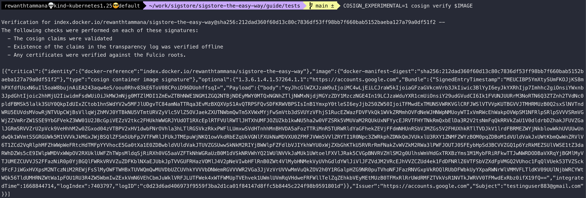

# Sign and verify without key (keyless signing)

In the previous section, we generated a key pair, it's stored on the file system & used for signing & verification of artifacts. But the keyless signing feature from cosign allows us to sign & verify without having the need to store keys.

## Set image

We can follow the steps from [this section](./sign-and-verify-with-key.md#set-image) to set the image. Let's ensure the `IMAGE` variable is set.

```bash
echo $IMAGE
```


## Sign the artifact

Keyless signing redirects to OIDC provider login pages like Google, Github & Microsoft to sign the artifact. We can have our own OIDC configured but to keep things simple, let's skip that.

```bash
COSIGN_EXPERIMENTAL=1 cosign sign $IMAGE
```


In the output, we can see the `tlog entry created with index: 7403797`. The index differs on every upload. We can visit [compare the signatures uploaded to transparency log and registry section](../rekor/compare-the-signatures-uploaded-to-transparency-log-and-registry.md) to read how to query the transparency log with tlog index for verification & more.

## Verify the artifact

```bash
COSIGN_EXPERIMENTAL=1 cosign verify $IMAGE
```



Observe the list of checks performed above in this method,

```
The following checks were performed on each of these signatures:
  - The cosign claims were validated
  - Existence of the claims in the transparency log was verified offline
  - Any certificates were verified against the Fulcio roots.
```

As you can see above, with this method of signing, there's the involvement of [transparency log](../rekor/readme.md) and [fulcio](../fulcio/readme.md). 

## Inspecting the signature

We can parse the output to write custom queries. For instance, the below command helps to extract the issuer & subject information of the signer,

```bash
COSIGN_EXPERIMENTAL=1 cosign verify $IMAGE | jq -r '.[].optional| .Issuer + "-" + .Subject'
```


